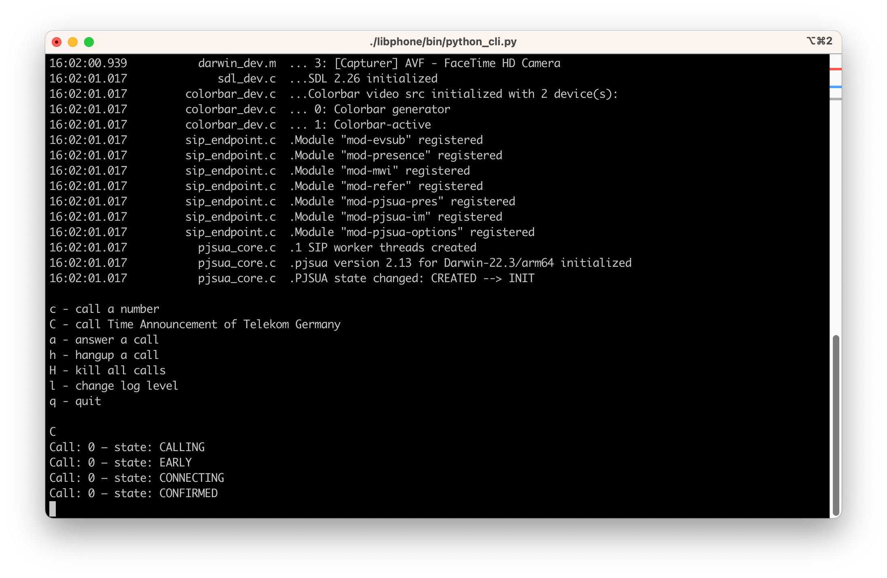
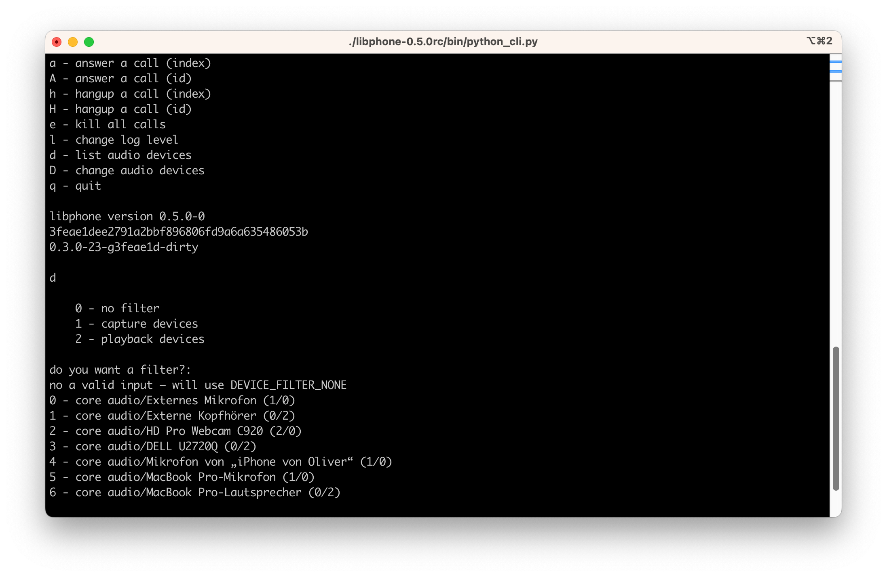

# libphone

libphone is a library that sits on top of [PJSIP project](https://github.com/pjsip/pjproject) and tries to make it very simple to build a softphone. libphone provides a C++ and a C-API. Included with the library is a Python script that demonstrates the API [python_cli.py](src/python_cli/python_cli.py). You can download one of the [binaries](#binaries) and just enter your SIP credentials if you want to test things out.

## Overview
<!-- TOC -->
* [libphone](#libphone)
  * [Overview](#overview)
  * [Usage](#usage)
    * [Callbacks](#callbacks)
  * [CLI Demo Phone](#cli-demo-phone)
  * [Compatibility with SIP providers](#compatibility-with-sip-providers)
    * [1und1 configuration](#1und1-configuration)
  * [Binaries](#binaries)
  * [Build instructions for Linux](#build-instructions-for-linux)
  * [Build instructions for macOS](#build-instructions-for-macos)
<!-- TOC -->

## Usage

You can create a phone with

```python
phone = phone_create("☎️", ["194.25.0.69","194.25.0.79"], "stun.t-online.de")
```

and connect the phone to your server via:

```python
phone_connect(phone, "tel.t-online.de", "your_sip_username", "your_sip_password")
```
Now you are ready to make a call:

```python
phone_make_call(phone, "+491804100100")
```

### Callbacks
You can register callback functions for incoming calls and their call states like this:

```python
phone_register_on_incoming_call_callback(phone, on_incoming_call, None)
phone_register_on_call_state_callback(phone, on_call_state, None)
```

The third parameter to the callback functions is required if you want to use the C-API with an object-oriented programming language like Swift:

```swift
phone_register_on_incoming_call_callback(phone, { callId, ctx in
    guard let ctx else { return }
    let me = Unmanaged<Model>.fromOpaque(ctx).takeUnretainedValue()
    DispatchQueue.main.async {
        me.current_call_id = callId
    }
}, Unmanaged.passRetained(self).toOpaque())
```

## Two ways to reference a call
Since version 0.2.0 libphone can reference a call via index or id. So every API call that references a call exists in two versions. One that takes an int parameter that is the call-index or a string that represents the call id. Consequently you can register callbacks that deliver one or the other to you.

```c
void phone_register_on_incoming_call_index_callback(phone_t instance, void (*cb)(int call_index, void *ctx), void *ctx);
void phone_register_on_incoming_call_id_callback(phone_t instance, void (*cb)(const char *call_id, void *ctx), void *ctx);
```

Or to hangup a call, for example:

```c
phone_status_t phone_hangup_call_index(phone_t instance, int call_index);
phone_status_t phone_hangup_call_id(phone_t instance, const char *call_id);
```

## CLI Demo Phone



Once you have the library installed there is a CLI Demo phone written in Python in the bin directory `libphone/bin/python_cli.py`. If you want to make a phone call you need to update the config section in the beginning of the script:

```python
useragent           = "Python CLI Phone"
nameservers         = ["217.237.148.22", "217.237.150.51"]
stunservers         = ["stun.t-online.de"]
sipserver           = "tel.t-online.de"
username            = "+49..."
password            = None
opus_channel_count  = 1
opus_complexity     = 8
opus_sample_rate    = 16000
buddy               = "+491804100100"
```

If you are a customer of DTAG (Deutsche Telekom AG) you can simply put in your username (which is your telephone number) and everything is set up. A password is not required for DTAG since your line-id is used for authentication.


## Compatibility with SIP providers

libphone should work with almost every SIP-provider out of the box. It's been tested with:
- DTAG (Deutsche Telekom)
- Starface
- TeamFON
- 1&1

I'd be very happy if you can test with your provider and give me feedback. I am willing to help. Reach me here [Oliver Epper](https://oliver-epper.de).

### 1und1 configuration

Thanks to [Andreas Weber](https://github.com/andreasweberd) for providing the details.

Use the following config:

```python
useragent           = "Python CLI Phone"
nameservers         = []
stunservers         = ["stun.1und1.de"]
sipserver           = "tls-sip.1und1.de"
username            = "49<your number>" # no '+'!
password            = "<password defined for number above at https://control-center.1und1.de/>"
opus_channel_count  = 1
opus_complexity     = 8
opus_sample_rate    = 16000
buddy               = "+491804100100"
```

If you provide nameservers the library will use SRV lookup which is not supported by 1und1. Providing no nameservers the library will fall back to use the getaddr call to resolv just the sip-servers ip address.

## Handling of audio devices

You can select the desired audio capture and audio playback device at any time. To list all the devices available in your system you can call:

```c
phone_status_t phone_get_audio_devices(audio_device_info_t *devices, size_t *devices_count, size_t max_driver_name_length, size_t max_device_name_length, device_filter_t filter);
```

You can iterate over the resulting array and print out all the device information:

```python
for device in phone_get_audio_devices(device_filter):
    print(f"{device.id} - {device.driver}/{device.name} ({device.input_count}/{device.output_count})")
```



To select capture and playback device use the function `phone_set_audio_devices`:

```c
phone_status_t phone_set_audio_devices(int capture_device, int playback_device);
```

## answer-after

There are certain information from the incoming SIP-INVITE that are saved in the call. The `answer-after` value is one of them. You can check if the INVITE had a header like this:

```pre
Call-Info: <sip:SERVER>;answer-after=SECONDS
```

 and receive the `SECONDS` via:

```c
phone_status_t phone_call_answer_after_index(phone_t instance, int call_index, int *answer_after);
```
or
```c
phone_status_t phone_call_answer_after_id(phone_t instance, const char *call_id, int *answer_after);
```

You can wrap that in a more pleasant call for your language of choice.
Python example:

```python
answer_after = phone_call_answer_after_index(phone, call_index)
if answer_after >= 0:
  print(f"will auto answer call after {answer_after} seconds")
```

## Binaries

I maintain binaries for macOS (signed, notarized and ready to go) and Ubuntu. You can get them from the GitHub release page, or my website [libphone](https://oliver-epper.de/apps/libphone/).

Depending on your type of Ubuntu installation you might need to install the following as dependencies:

```shell
sudo apt install libasound2 libopus0
```

## Build instructions for Linux

I've tested this on Ubuntu 22.04.

First install the build-dependencies:

```shell
apt install build-essential git pkg-config cmake python3-minimal libssl-dev libasound2-dev libopus-dev ninja-build
```

Ninja ist not required, but much faster than building with make.    
Check out pjproject:

```shell
git -c advice.detachedHead=false clone --depth 1 --branch "2.13" https://github.com/pjsip/pjproject
```

This will give you the 2.13 release of pjproject which I tested.
Build pjproject with the following commands:

```shell
pushd pjproject
cat << EOF > pjlib/include/pj/config_site.h
#define PJ_HAS_SSL_SOCK 1
#include <pj/config_site_sample.h>
EOF
cat << EOF > user.mak
export CFLAGS += -fPIC
EOF
./configure --prefix=$(echo ~)/installed/pjproject
make dep && make clean
make
make install
popd
```

Once installed into `~/installed/pjproject` you need to change two things:

```shell
pushd ~/installed/pjproject
ar -rcT lib/libpjproject.a lib/*.a
cp lib/pkgconfig/libpjproject.pc lib/pkgconfig/libpjproject.orig
popd
```

Please edit the file `~/installed/pjproject/lib/pkgconfig/libpjproject.pc` to contain the following (example from my build-docker):

```text
prefix=/home/oliver/installed/pjproject
libdir=${prefix}/lib
includedir=${prefix}/include

Name: libpjproject
Description: Multimedia communication library
URL: http://www.pjsip.org
Version: 2.13
Libs: -L${libdir} -lpjproject -lcrypto -lssl -lasound -lopus
Cflags: -I${includedir} -DPJ_AUTOCONF=1  -DPJ_IS_BIG_ENDIAN=0 -DPJ_IS_LITTLE_ENDIAN=1
```

This is an example from my build machine. You need the correct path for `prefix`.

Once that is in place you can start building libphone. I prefer building out of the source tree, so from inside your libphone directory go up on level.

```shell
cmake -Slibphone -Bbuild-libphone -GNinja -DCMAKE_PREFIX_PATH=$(echo ~)/installed/pjproject -DCMAKE_C_FLAGS="-fPIC" -DCMAKE_CXX_FLAGS="-fPIC" -DCMAKE_INSTALL_PREFIX=$(echo ~)/installed/libphone --log-level=DEBUG
cmake --build build-libphone --config Release --target install
```


## Build instructions for macOS

You can use my already prebuild package `pjproject-apple-platforms`. Install it with the following commands:

```shell
brew tap oliverepper/made
brew install pjproject-apple-platforms
```

libphone can now be build with the following commands:

```shell
cmake -Slibphone -Bbuild-libphone -GNinja -DCMAKE_INSTALL_PREFIX=$(echo ~)/installed/libphone --log-level=DEBUG
cmake --build build-libphone --config Release --target install
```
